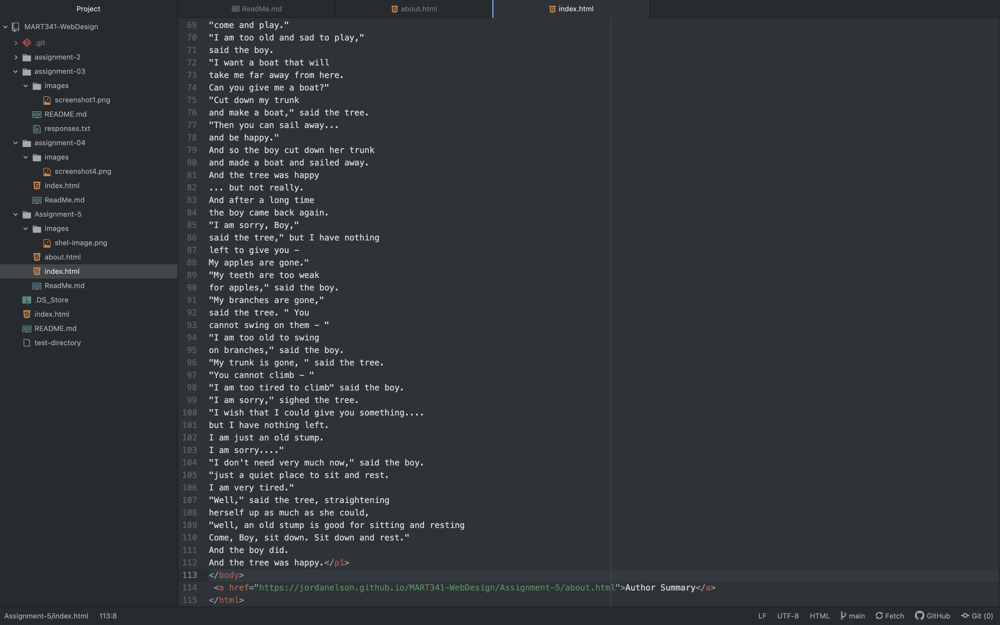

My snapshot was of the Food Network website from October 2013. It showed various Halloween recipes and television shows. It's logo and theme is the old red one that I remember growing up. The website has changed because it now has a much more minimalistic layout with more photos of food.

My experience with the last few topics has been slightly difficult just because this is my first time dealing with html. I have learned so much about how html creates the structure for websites and I have struggled with using the correct punctuation to make sure it translates properly.

