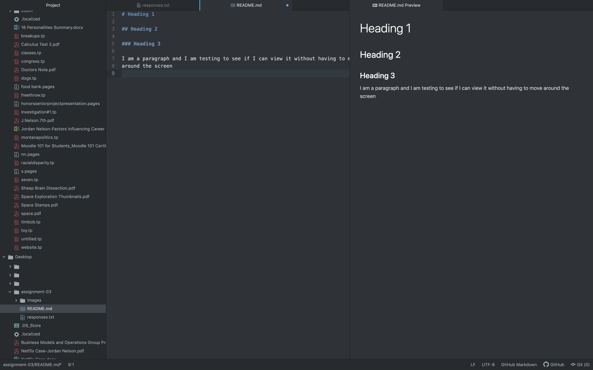

# Assignment 3

## Jordan Nelson

1. How to create a folder on Atom.
2. How to add a screenshot to a subdirectory on atom.
3. How to add a folder onto my repository on GitHub.

[Urban Outfitters](https://www.urbanoutfitters.com)

[My Responses](./responses.txt)

