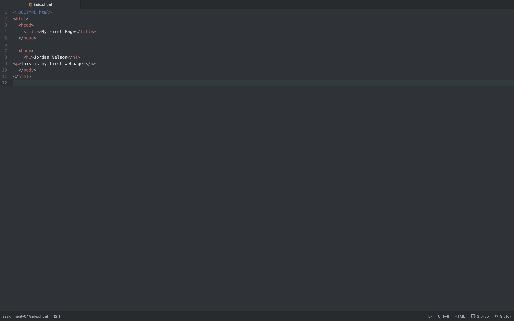

A browser is a program used to access the internet from a device that uses web languages to translate content. The main browser I use is Google Chrome, I find that it works the best.

Markup language is made up of easily understood keywords to define elements within a document. An example is HTML.

